# GitHub Actions Workflows

This directory contains automated workflows for continuous integration, deployment, and maintenance of the FerrisScript project.

## Table of Contents

- [Available Workflows](#available-workflows)
  - [CI/CD Pipeline](#cicd-pipeline)
  - [Documentation Linting](#documentation-linting)
  - [PR Template Automation](#pr-template-automation)
- [Workflow Visualization](#workflow-visualization)
- [Job Details](#job-details)
- [Event Flow Examples](#event-flow-examples)
- [Performance Metrics](#performance-metrics)

---

## Available Workflows

### CI/CD Pipeline

**File:** [`ci.yml`](ci.yml)  
**Name:** CI/CD  
**Triggers:**

- Pull requests to `main`
- Pushes to `main` or `develop` branches
- Tags matching `v*` pattern

**Jobs:**

1. **test** - Runs on all events
   - Multi-OS testing (Ubuntu, Windows, macOS)
   - Cargo tests, clippy, formatting checks
   - Always runs (~15 minutes)

2. **build** - Conditional execution
   - Only on push to `main` or tags `v*`
   - Builds release binaries for all platforms
   - Uploads artifacts (~15 minutes)

3. **release** - Tag-only execution
   - Only on tags matching `v*`
   - Creates GitHub Release
   - Attaches platform-specific binaries (~2 minutes)

4. **coverage** - Main branch only
   - Only on push to `main`
   - Generates code coverage with tarpaulin
   - Uploads to Codecov (~3 minutes)

---

### Documentation Linting

**File:** [`docs-lint.yml`](docs-lint.yml)  
**Name:** Documentation Linting  
**Triggers:**

- Pull requests with markdown changes
- Pushes to `main` with markdown changes

**Jobs:**

1. **markdown-lint** - Style and formatting
   - Uses markdownlint-cli
   - Config: `.markdownlint.json`

2. **link-check** - Validates URLs
   - Checks all markdown links
   - Config: `.markdown-link-check.json`

---

### PR Template Automation

**File:** [`pr-template.yml`](pr-template.yml)  
**Name:** Auto Apply PR Template  
**Triggers:**

- Pull request opened events only

**Jobs:**

1. **apply-template** - Branch-based template selection
   - Detects branch naming pattern
   - Applies appropriate PR template
   - Posts explanation comment

**Branch Patterns:**

| Branch Pattern | Template Applied |
|----------------|------------------|
| `bugfix/*` or `fix/*` | `bug_fix.md` |
| `feature/*` or `feat/*` | `feature.md` |
| `docs/*` or `doc/*` | `docs.md` |
| Other | `docs.md` (default) |

---

## Workflow Visualization

### CI/CD Pipeline Flow

```mermaid
flowchart TD
    Start([Event Triggered]) --> CheckEvent{Event Type?}
    
    CheckEvent -->|Pull Request to main| PR[Pull Request Flow]
    CheckEvent -->|Push to main| MainPush[Main Push Flow]
    CheckEvent -->|Push to develop| DevPush[Develop Push Flow]
    CheckEvent -->|Push tag v*| TagPush[Release Tag Flow]
    
    %% Pull Request Flow
    PR --> TestPR[✅ Test Job<br/>3 OS: Ubuntu, Windows, macOS]
    TestPR --> BuildCheck1{Build Condition:<br/>Push to main OR tag?}
    BuildCheck1 -->|No - PR| BuildSkipPR[❌ Build Job SKIPPED<br/>Not on PR]
    BuildSkipPR --> CovCheck1{Coverage Condition:<br/>Push to main?}
    CovCheck1 -->|No - PR| CovSkipPR[❌ Coverage Job SKIPPED<br/>Not on PR]
    CovSkipPR --> PREnd([PR Complete<br/>~15 minutes])
    
    %% Main Push Flow
    MainPush --> TestMain[✅ Test Job<br/>3 OS: Ubuntu, Windows, macOS]
    TestMain --> BuildCheck2{Build Condition:<br/>Push to main OR tag?}
    BuildCheck2 -->|Yes - main| BuildMain[✅ Build Job<br/>3 OS: Ubuntu, Windows, macOS]
    BuildMain --> ReleaseCheck1{Release Condition:<br/>Tag v*?}
    ReleaseCheck1 -->|No - main push| ReleaseSkipMain[❌ Release Job SKIPPED<br/>No tag]
    ReleaseSkipMain --> CovCheck2{Coverage Condition:<br/>Push to main?}
    CovCheck2 -->|Yes - main| CovMain[✅ Coverage Job<br/>Ubuntu only]
    CovMain --> MainEnd([Main Push Complete<br/>~33 minutes])
    
    %% Develop Push Flow
    DevPush --> TestDev[✅ Test Job<br/>3 OS: Ubuntu, Windows, macOS]
    TestDev --> BuildCheck3{Build Condition:<br/>Push to main OR tag?}
    BuildCheck3 -->|No - develop| BuildSkipDev[❌ Build Job SKIPPED<br/>Not main/tag]
    BuildSkipDev --> CovCheck3{Coverage Condition:<br/>Push to main?}
    CovCheck3 -->|No - develop| CovSkipDev[❌ Coverage Job SKIPPED<br/>Not main]
    CovSkipDev --> DevEnd([Develop Push Complete<br/>~15 minutes])
    
    %% Release Tag Flow
    TagPush --> TestTag[✅ Test Job<br/>3 OS: Ubuntu, Windows, macOS]
    TestTag --> BuildCheck4{Build Condition:<br/>Push to main OR tag?}
    BuildCheck4 -->|Yes - tag| BuildTag[✅ Build Job<br/>3 OS: Ubuntu, Windows, macOS]
    BuildTag --> ReleaseCheck2{Release Condition:<br/>Tag v*?}
    ReleaseCheck2 -->|Yes - tag| ReleaseTag[✅ Release Job<br/>Creates GitHub Release<br/>Uploads artifacts]
    ReleaseTag --> CovCheck4{Coverage Condition:<br/>Push to main?}
    CovCheck4 -->|Yes - tag on main| CovTag[✅ Coverage Job<br/>Ubuntu only]
    CovTag --> TagEnd([Release Complete<br/>~35 minutes])
    
    style TestPR fill:#228B22,color:#FFFFFF
    style TestMain fill:#228B22,color:#FFFFFF
    style TestDev fill:#228B22,color:#FFFFFF
    style TestTag fill:#228B22,color:#FFFFFF
    
    style BuildMain fill:#228B22,color:#FFFFFF
    style BuildTag fill:#228B22,color:#FFFFFF
    style BuildSkipPR fill:#DC143C,color:#FFFFFF
    style BuildSkipDev fill:#DC143C,color:#FFFFFF
    
    style ReleaseTag fill:#228B22,color:#FFFFFF
    style ReleaseSkipMain fill:#DC143C,color:#FFFFFF
    
    style CovMain fill:#228B22,color:#FFFFFF
    style CovTag fill:#228B22,color:#FFFFFF
    style CovSkipPR fill:#DC143C,color:#FFFFFF
    style CovSkipDev fill:#DC143C,color:#FFFFFF
    
    style PREnd fill:#1E90FF,color:#FFFFFF
    style MainEnd fill:#1E90FF,color:#FFFFFF
    style DevEnd fill:#1E90FF,color:#FFFFFF
    style TagEnd fill:#1E90FF,color:#FFFFFF
```



**Legend:**

- 🟢 **Green** (Forest Green) = Job runs
- 🔴 **Red** (Crimson) = Job skipped
- 🔵 **Blue** (Dodger Blue) = Completion state

---

## Job Details

### Test Job (ci.yml)

**Condition:** Always runs

```yaml
name: Test
runs-on: [ubuntu-latest, windows-latest, macos-latest]
```

**When it runs:**

- ✅ Pull requests to main
- ✅ Push to main
- ✅ Push to develop
- ✅ Push tag v*

**Steps:**

- Checkout code
- Install Rust toolchain (stable)
- Cache cargo dependencies
- Run `cargo test --workspace --verbose`
- Run `cargo clippy` (continue on error)
- Check formatting with `cargo fmt --all -- --check`

---

### Build Job (ci.yml)

**Condition:** Push to main OR tag v*

```yaml
name: Build Release
needs: test
if: github.event_name == 'push' && 
    (github.ref == 'refs/heads/main' || startsWith(github.ref, 'refs/tags/v'))
runs-on: [ubuntu-latest, windows-latest, macos-latest]
```

**When it runs:**

- ❌ Pull requests to main (SKIPPED)
- ✅ Push to main
- ❌ Push to develop (SKIPPED)
- ✅ Push tag v*

**Artifacts:**

- `ferrisscript-linux-x86_64.so` (Ubuntu)
- `ferrisscript-windows-x86_64.dll` (Windows)
- `ferrisscript-macos-x86_64.dylib` (macOS)

---

### Release Job (ci.yml)

**Condition:** Tag v* only

```yaml
name: Create Release
needs: build
if: startsWith(github.ref, 'refs/tags/v')
runs-on: ubuntu-latest
```

**When it runs:**

- ❌ Pull requests to main (SKIPPED)
- ❌ Push to main (SKIPPED)
- ❌ Push to develop (SKIPPED)
- ✅ Push tag v*

**Actions:**

- Downloads all build artifacts
- Creates GitHub Release with tag name
- Attaches platform binaries
- Includes `RELEASE_NOTES.md` as body

---

### Coverage Job (ci.yml)

**Condition:** Push to main only

```yaml
name: Code Coverage
if: github.event_name == 'push' && github.ref == 'refs/heads/main'
runs-on: ubuntu-latest
```

**When it runs:**

- ❌ Pull requests to main (SKIPPED)
- ✅ Push to main
- ❌ Push to develop (SKIPPED)
- ❌ Push tag v* (SKIPPED unless on main)

**Tools:**

- `cargo-tarpaulin` for coverage generation
- Codecov for reporting

---

## Event Flow Examples

### Example 1: Opening a Pull Request

```text
1. Developer creates PR #42 to main
   ↓
2. CI Triggers: pull_request event
   ↓
3. Test Job: ✅ Runs (Ubuntu, Windows, macOS)
   ├─ cargo test --workspace
   ├─ cargo clippy
   └─ cargo fmt --check
   ↓
4. Build Job: ❌ Skipped (condition: push to main/tag)
   ↓
5. Coverage Job: ❌ Skipped (condition: push to main)
   ↓
6. Docs Lint: ✅ Runs if markdown files changed
   ├─ markdownlint
   └─ markdown-link-check
   ↓
7. PR Template: ✅ Applied based on branch name
   ↓
8. Result: PR validated in ~15 minutes
```

### Example 2: Merging PR to Main

```text
1. PR #42 merged to main branch
   ↓
2. CI Triggers: push event (main)
   ↓
3. Test Job: ✅ Runs (Ubuntu, Windows, macOS)
   ↓
4. Build Job: ✅ Runs (Ubuntu, Windows, macOS)
   ├─ Builds release binaries
   └─ Uploads artifacts
   ↓
5. Coverage Job: ✅ Runs (Ubuntu)
   ├─ cargo tarpaulin
   └─ Upload to Codecov
   ↓
6. Release Job: ❌ Skipped (no tag)
   ↓
7. Docs Lint: ✅ Runs if markdown files changed
   ↓
8. Result: Main branch fully validated in ~33 minutes
```

### Example 3: Creating a Release

```text
1. Developer pushes tag v0.1.0 to main
   ↓
2. CI Triggers: push event (tag v*)
   ↓
3. Test Job: ✅ Runs (Ubuntu, Windows, macOS)
   ↓
4. Build Job: ✅ Runs (Ubuntu, Windows, macOS)
   ├─ Builds release binaries for all platforms
   └─ Uploads artifacts
   ↓
5. Release Job: ✅ Runs (Ubuntu)
   ├─ Downloads all artifacts
   ├─ Creates GitHub Release v0.1.0
   └─ Attaches binaries + gdextension
   ↓
6. Coverage Job: ✅ Runs (Ubuntu)
   ├─ cargo tarpaulin
   └─ Upload to Codecov
   ↓
7. Result: Release v0.1.0 published in ~35 minutes
```

---

## Performance Metrics

### Timing Breakdown

| Event | Test | Build | Release | Coverage | Total Time |
|-------|------|-------|---------|----------|------------|
| **PR to main** | ~15m (3 OS) | ❌ Skip | ❌ Skip | ❌ Skip | **~15 min** |
| **Push to main** | ~15m (3 OS) | ~15m (3 OS) | ❌ Skip | ~3m | **~33 min** |
| **Push to develop** | ~15m (3 OS) | ❌ Skip | ❌ Skip | ❌ Skip | **~15 min** |
| **Push tag v*** | ~15m (3 OS) | ~15m (3 OS) | ~2m | ~3m | **~35 min** |

### Cost Savings Analysis

#### Before Optimization

- Every PR: Test + Build + Coverage = ~33 minutes
- Every push to main: Test + Build + Coverage = ~33 minutes
- **Total for PR → merge: ~66 minutes**

#### After Optimization

- PR: Test only = ~15 minutes
- Push to main: Test + Build + Coverage = ~33 minutes
- **Total for PR → merge: ~48 minutes**
- **Savings: 18 minutes per PR (27% reduction)**

#### Optimization Strategy

1. **Build Job** - Skip on PRs
   - Rationale: PRs don't need release artifacts
   - Savings: ~15 minutes per PR

2. **Coverage Job** - Run only on main
   - Rationale: Full coverage needed only for main branch
   - Savings: ~3 minutes per PR

3. **Release Job** - Tag-gated
   - Rationale: Only create releases for version tags
   - No change (already optimized)

---

## Configuration Files

### Workflow Configs

- `.markdownlint.json` - Markdown style rules
- `.markdown-link-check.json` - Link checking configuration
- `tarpaulin.toml` - Code coverage settings

### Related Documentation

- [CONTRIBUTING.md](../../CONTRIBUTING.md) - Branch naming conventions
- [docs/DEVELOPMENT.md](../../docs/DEVELOPMENT.md) - Development workflow
- [.github/prompts/PR_TEMPLATE_SYSTEM.md](../prompts/PR_TEMPLATE_SYSTEM.md) - PR template system guide

---

## Troubleshooting

### Workflow Not Triggering

**Issue:** Workflow doesn't run on push/PR

**Check:**

1. Branch matches trigger pattern
2. File paths match (for docs-lint)
3. Workflow file has no YAML syntax errors

### Job Skipped Unexpectedly

**Issue:** Expected job doesn't run

**Check:**

1. Review job `if` conditions in `ci.yml`
2. Verify event type matches condition
3. Check previous job success (for `needs`)

### PR Template Not Applied

**Issue:** Template not auto-applied on PR creation

**Check:**

1. Branch name matches pattern (`bugfix/*`, `feature/*`, `docs/*`)
2. PR was just opened (not edited/synced)
3. Template file exists in `.github/PULL_REQUEST_TEMPLATE/`

### Build Artifacts Missing

**Issue:** Release job can't find artifacts

**Check:**

1. Build job completed successfully
2. Artifact names match expected pattern
3. Download artifacts step has correct names

---

## Maintenance Notes

### Adding New Jobs

1. Add job definition to appropriate workflow file
2. Update this README with job details
3. Update Mermaid diagram if affects CI/CD flow
4. Test with a draft PR

### Modifying Conditions

1. Edit `if` conditions in workflow file
2. Update job details section in this README
3. Regenerate timing estimates
4. Update Mermaid diagram flow

### Changing Triggers

1. Modify `on` section in workflow file
2. Update "Available Workflows" section
3. Test with appropriate event type

---

## See Also

- [GitHub Actions Documentation](https://docs.github.com/en/actions)
- [Rust CI/CD Best Practices](https://doc.rust-lang.org/cargo/guide/continuous-integration.html)
- [Codecov Integration](https://docs.codecov.com/docs/quick-start)
- [Mermaid Diagram Syntax](https://mermaid.js.org/syntax/flowchart.html)
