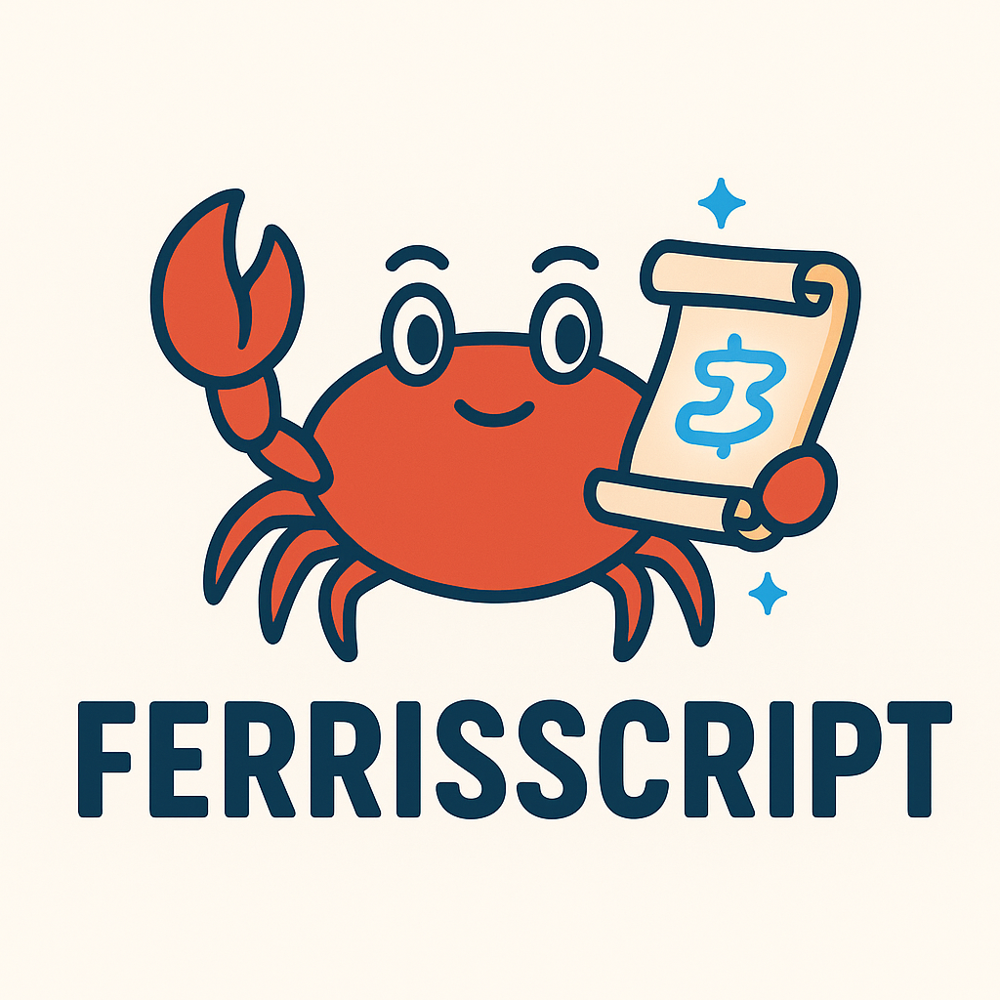

<div align="center">
  
  
# FerrisScript 🦀

A Rust-inspired scripting language for Godot 4.x

[](LICENSE)
[](https://www.rust-lang.org/)
[](https://godotengine.org/)
[](https://github.com/dev-parkins/FerrisScript/actions)
[](docs/v0.0.2/TEST_COVERAGE_ANALYSIS.md)

**Quick Links**: [📖 Docs](docs/) | [🐛 Issues](https://github.com/dev-parkins/FerrisScript/issues) | [💬 Discussions](https://github.com/dev-parkins/FerrisScript/discussions) | [❓ FAQ](docs/FAQ.md) | [🔧 Troubleshooting](docs/TROUBLESHOOTING.md)

</div>

FerrisScript (named after [Ferris 🦀](https://rustacean.net/), the Rust mascot) is a **statically-typed, Rust-inspired scripting language** designed specifically for Godot 4.x game development. It brings Rust's safety and performance philosophy to game scripting while maintaining a lightweight, easy-to-learn syntax.

## 🎯 Why FerrisScript?

### For Rust Developers

- **Familiar Syntax**: If you know Rust, you already know 80% of FerrisScript
- **Type Safety**: Catch bugs at compile-time, not in production
- **Performance**: Static type checking enables optimization opportunities
- **No GC Pauses**: Deterministic performance for game loops

### For Game Developers

- **Better Tooling**: Static typing enables IDE features (autocomplete, go-to-definition)
- **Easier Refactoring**: Type checker catches breaking changes automatically
- **Self-Documenting**: Types serve as inline documentation
- **Gradual Learning**: Start simple, grow into advanced features

### For Teams

- **Clear Contracts**: Function signatures document expected inputs/outputs
- **Fewer Runtime Errors**: Many bugs caught before playtesting
- **Code Confidence**: Refactor fearlessly with type safety
- **Performance Baseline**: [16K+ function calls per frame at 60 FPS](docs/BENCHMARK_BASELINE.md)

**TL;DR**: FerrisScript brings Rust's "if it compiles, it probably works" philosophy to game scripting, making your game development faster and more reliable.

## ⚖️ FerrisScript vs. GDScript

| Feature | FerrisScript | GDScript |
|---------|-------------|----------|
| **Type System** | Static, compile-time checked | Dynamic with optional hints |
| **Error Detection** | Compile-time (before running game) | Runtime (during gameplay) |
| **Performance** | ~1 μs/function call | ~2-3 μs/function call* |
| **IDE Support** | LSP planned (v0.1.0) | Excellent (built-in) |
| **Learning Curve** | Moderate (Rust-like syntax) | Easy (Python-like) |
| **Refactoring Safety** | High (type checker catches breaks) | Medium (manual testing needed) |
| **Godot Integration** | Via GDExtension | Native |
| **Hot Reload** | Planned (v0.1.0) | Yes |
| **Maturity** | Alpha (v0.0.2) | Production-ready |

\* Performance comparison is preliminary and varies by use case. See [BENCHMARK_BASELINE.md](docs/BENCHMARK_BASELINE.md) for details.

**When to Choose FerrisScript**:

- You prefer static typing and compile-time safety
- Coming from Rust/TypeScript/C# background
- Building complex systems that benefit from type checking
- Want performance predictability (no GC pauses)

**When to Choose GDScript**:

- Prototyping and rapid iteration
- Small to medium projects
- Prefer dynamic typing flexibility
- Want seamless Godot editor integration

**Use Both**: FerrisScript and GDScript can coexist in the same project. Use FerrisScript for performance-critical systems and GDScript for rapid prototyping.

## ✨ Features

- 🦀 **Rust-Inspired Syntax** - Familiar to Rust developers, easy for beginners
- 🎮 **Godot 4.x Integration** - Native GDExtension support via `gdext`
- ⚡ **Static Type Checking** - Catch errors before runtime
- 🔒 **Immutability by Default** - Safe by default, explicit `mut` for mutations
- 🎯 **Zero-Cost Abstractions** - Compiled to efficient runtime execution
- 📦 **Minimal Dependencies** - Lightweight and fast compilation

## 🚀 Quick Start

### Prerequisites

- **Rust 1.70+** ([Install Rust](https://www.rust-lang.org/tools/install))
- **Godot 4.2+** ([Download Godot](https://godotengine.org/download))
- **Git** (for cloning the repository)

### Installation

```bash
# Clone the repository
git clone https://github.com/dev-parkins/FerrisScript.git
cd FerrisScript

# Build the project
cargo build --workspace

# Run tests
cargo test --workspace
```

### Using in Godot

1. **Build the GDExtension:**

   ```bash
   cargo build --package ferrisscript_godot_bind
   ```

2. **Open the test project:**
   - Open Godot 4.2+
   - Import project from `godot_test/project.godot`

3. **Create your first script:**

   ```rust
   // my_script.ferris
   fn _ready() {
       print("Hello from FerrisScript!");
   }

   fn _process(delta: f32) {
       self.position.x += 50.0 * delta;
   }
   ```

4. **Attach to a node:**
   - Add `FerrisScriptNode` to your scene
   - Set `script_path` to `res://scripts/my_script.ferris`
   - Run your game!

## 📖 Language Overview

### Basic Syntax

```rust
// Variables - immutable by default
let name: String = "Ferris";
let age: i32 = 42;

// Mutable variables - explicit opt-in
let mut counter: i32 = 0;
counter = counter + 1;

// Functions
fn greet(name: String) -> String {
    return "Hello, " + name;
}

// Control flow
if age > 18 {
    print("Adult");
} else {
    print("Minor");
}

// Loops
let mut i: i32 = 0;
while i < 10 {
    print(i);
    i = i + 1;
}
```

### Godot Integration

```rust
// Global state persists between frames
let mut velocity: f32 = 0.0;
let gravity: f32 = 980.0;

fn _ready() {
    print("Game started!");
}

fn _process(delta: f32) {
    // Access node properties via 'self'
    velocity = velocity + gravity * delta;
    self.position.y += velocity * delta;
    
    // Bounce at ground level
    if self.position.y > 500.0 {
        velocity = -velocity * 0.8;
        self.position.y = 500.0;
    }
}
```

### Type System

FerrisScript supports the following types:

- **Primitives**: `i32`, `f32`, `bool`, `String`
- **Godot Types**: `Vector2`, `Node`, `Node2D`
- **Type Inference**: Literals are automatically typed
- **Type Coercion**: `i32` → `f32` automatic conversion

### ⚡ Performance Characteristics

FerrisScript is designed for **game scripting performance** with predictable overhead:

| Operation | Performance | Notes |
|-----------|-------------|-------|
| **Lexer** | 384 ns - 3.74 μs | Per-script compilation |
| **Parser** | 600 ns - 7.94 μs | Per-script compilation |
| **Type Checker** | 851 ns - 3.58 μs | Per-script compilation |
| **Function Call** | ~1.05 μs | Per-call overhead at runtime |
| **Loop Iteration** | ~180 ns | Per-iteration overhead |

**Real-World Performance**:

- **60 FPS Budget**: 16.67 ms per frame
- **Function Calls/Frame**: ~16,000 calls possible at 60 FPS
- **Compilation**: Sub-millisecond for typical game scripts
- **Memory**: Minimal overhead (~1 KB per script)

**Optimization Tips**:

1. **Cache Frequently Used Values**: Store `self.position` in local variables
2. **Minimize Cross-Boundary Calls**: Batch operations when possible
3. **Use Appropriate Types**: `f32` for game math, `i32` for counters
4. **Profile First**: Use Godot's profiler to identify bottlenecks

See [BENCHMARK_BASELINE.md](docs/BENCHMARK_BASELINE.md) for detailed performance analysis and methodology.

## 🏗️ Project Structure

```
ferrisscript/
├── Cargo.toml                 # Workspace root
├── README.md                  # This file
├── crates/
│   ├── compiler/              # Lexer, Parser, Type Checker
│   │   ├── Cargo.toml
│   │   └── src/
│   │       ├── lib.rs         # Public compile() API
│   │       ├── lexer.rs       # Tokenization
│   │       ├── parser.rs      # AST generation
│   │       ├── type_checker.rs# Static type checking
│   │       └── ast.rs         # AST definitions
│   ├── runtime/               # Execution engine
│   │   ├── Cargo.toml
│   │   └── src/
│   │       └── lib.rs         # Runtime interpreter
│   └── godot_bind/            # Godot 4.x integration
│       ├── Cargo.toml
│       └── src/
│           └── lib.rs         # GDExtension bindings
├── examples/                  # Example scripts
│   ├── hello.ferris           # Basic _ready callback
│   ├── move.ferris            # Movement example
│   └── bounce.ferris          # State & control flow
├── godot_test/                # Godot test project
│   ├── project.godot
│   ├── ferrisscript.gdextension
│   └── scripts/               # Test scripts
└── docs/                      # Additional documentation
    ├── PHASE*_TESTING.md      # Phase testing guides
    └── copilot-checklist.md   # Development checklist
```

## 🔧 Building from Source

### Build All Crates

```bash
# Debug build (faster compilation)
cargo build --workspace

# Release build (optimized)
cargo build --workspace --release

# Run all tests
cargo test --workspace
```

### Build Specific Crates

```bash
# Compiler only
cargo build --package ferrisscript_compiler

# Runtime only
cargo build --package ferrisscript_runtime

# Godot extension only
cargo build --package ferrisscript_godot_bind
```

### Running Tests

```bash
# All tests
cargo test --workspace

# Compiler tests (44 tests)
cargo test --package ferrisscript_compiler

# Runtime tests (26 tests)
cargo test --package ferrisscript_runtime

# Watch mode (with cargo-watch)
cargo watch -x "test --workspace"
```

## 🎮 Godot Integration Guide

### Step 1: Build the Extension

```bash
cargo build --package ferrisscript_godot_bind
```

This creates:

- **Windows**: `target/debug/ferrisscript_godot_bind.dll`
- **Linux**: `target/debug/libferrisscript_godot_bind.so`
- **macOS**: `target/debug/libferrisscript_godot_bind.dylib`

### Step 2: Set Up Your Godot Project

1. Create a new Godot 4.2+ project
2. Create `.gdextension` file in your project root:

```ini
[configuration]
entry_symbol = "gdext_rust_init"
compatibility_minimum = 4.2

[libraries]
windows.debug.x86_64 = "res://../target/debug/ferrisscript_godot_bind.dll"
windows.release.x86_64 = "res://../target/release/ferrisscript_godot_bind.dll"
linux.debug.x86_64 = "res://../target/debug/libferrisscript_godot_bind.so"
linux.release.x86_64 = "res://../target/release/libferrisscript_godot_bind.so"
macos.debug = "res://../target/debug/libferrisscript_godot_bind.dylib"
macos.release = "res://../target/release/libferrisscript_godot_bind.dylib"
```

### Step 3: Create Script Files

Create a `.ferris` file in your project:

```rust
// scripts/player.ferris
let mut speed: f32 = 200.0;

fn _ready() {
    print("Player initialized!");
}

fn _process(delta: f32) {
    // Your game logic here
    self.position.x += speed * delta;
}
```

### Step 4: Attach to Nodes

1. Add `FerrisScriptNode` (extends Node2D) to your scene
2. In the Inspector, set `script_path` to `res://scripts/player.ferris`
3. Run your game!

## 📚 Examples

FerrisScript comes with comprehensive examples to help you get started:

### 🎯 [Hello World](examples/hello/README.md)

**Difficulty**: Beginner  
Learn the basics of FerrisScript with a simple "Hello, World!" script.

- Using the `_ready()` lifecycle hook
- Calling builtin functions (`print`)
- Basic FerrisScript syntax

```ferris
fn _ready() {
    print("Hello from FerrisScript!");
}
```

**[📖 Full tutorial →](examples/hello/README.md)**

### 🚀 [Move Example](examples/move/README.md)

**Difficulty**: Beginner  
Create smooth movement with frame-by-frame updates.

- Using `_process(delta)` for animations
- Accessing node properties (`self.position`)
- Understanding delta time for framerate-independent movement

```ferris
fn _process(delta: f32) {
    self.position.x += 50.0 * delta;
}
```

**[📖 Full tutorial →](examples/move/README.md)**

### ⚡ [Bounce Example](examples/bounce/README.md)

**Difficulty**: Intermediate  
Build a bouncing animation with boundary checks.

- Global variables and state management
- Conditional statements (`if`)
- Direction reversal and boundary detection

```ferris
let mut dir: f32 = 1.0;

fn _process(delta: f32) {
    self.position.x += dir * 100.0 * delta;

    if self.position.x > 10.0 {
        dir = -1.0;
    }
    if self.position.x < -10.0 {
        dir = 1.0;
    }
}
```

**[📖 Full tutorial →](examples/bounce/README.md)**

### More Examples

- **`functions.ferris`**: Function definitions and calls
- **`collections.ferris`**: Arrays and dictionaries (v0.1.0+)
- **`match.ferris`**: Pattern matching (v0.1.0+)

See the [`examples/`](examples/) directory for all available scripts.

## 📚 API Reference

### Built-in Functions

- `print(value)` - Print to Godot console

### Special Functions

- `_ready()` - Called when node enters the scene tree
- `_process(delta: f32)` - Called every frame

### Self Binding

Access node properties via `self`:

- `self.position` - Node's position (Vector2)
- `self.position.x` - X coordinate (f32)
- `self.position.y` - Y coordinate (f32)

## 🧪 Testing

### Manual Testing in Godot

The `godot_test/` directory contains a complete test project:

```bash
# 1. Build extension
cargo build --package ferrisscript_godot_bind

# 2. Open in Godot
# Import godot_test/project.godot

# 3. Run tests (F5)
# Check Output panel for results
```

See `godot_test/README.md` for detailed testing instructions.

### Automated Testing

```bash
# Run all unit tests
cargo test --workspace

# Test results:
# - Compiler: 44 tests passing
# - Runtime: 26 tests passing
# - Total: 70+ tests
```

## 📊 Current Status (v0.0.1)

### ✅ Implemented Features

- [x] Lexer with full tokenization
- [x] Parser with operator precedence
- [x] Type checker with static analysis
- [x] Runtime interpreter
- [x] Godot 4.x GDExtension integration
- [x] `_ready()` and `_process()` callbacks
- [x] Self binding for node property access
- [x] Mutable variable tracking
- [x] Control flow (if/else, while loops)
- [x] Function definitions and calls
- [x] Global state persistence

### 🚧 Planned Features (v0.1.0+)

- [ ] Arrays and collections
- [ ] For loops
- [ ] String interpolation
- [ ] More Godot types (Node3D, Input, etc.)
- [ ] Signal system integration
- [ ] Struct definitions
- [ ] Match expressions
- [ ] LSP support for IDE integration

## 🤝 Contributing

Contributions are welcome! Please feel free to submit issues or pull requests.

### Development Workflow

1. Fork the repository
2. Create a feature branch (`git checkout -b feature/amazing-feature`)
3. Make your changes
4. Run tests (`cargo test --workspace`)
5. Commit your changes (`git commit -m 'feat: add amazing feature'`)
6. Push to the branch (`git push origin feature/amazing-feature`)
7. Open a Pull Request

### Commit Conventions

We follow [Conventional Commits](https://www.conventionalcommits.org/):

- `feat:` - New feature
- `fix:` - Bug fix
- `docs:` - Documentation changes
- `test:` - Test additions/changes
- `refactor:` - Code refactoring
- `chore:` - Maintenance tasks

## 📜 License

This project is licensed under the MIT License - see the [LICENSE](LICENSE) file for details.

## 🙏 Acknowledgments

- **Ferris** 🦀 - The Rust mascot that inspired our name
- **Godot Engine** - Amazing open-source game engine
- **gdext** - Rust bindings for Godot 4
- **Rust Community** - For the incredible language and ecosystem

## 📞 Contact & Support

- **Issues**: [GitHub Issues](https://github.com/dev-parkins/FerrisScript/issues)
- **Discussions**: [GitHub Discussions](https://github.com/dev-parkins/FerrisScript/discussions)
- **Documentation**: [docs/](./docs/)

---

Made with 🦀 and ❤️ for the Godot community
