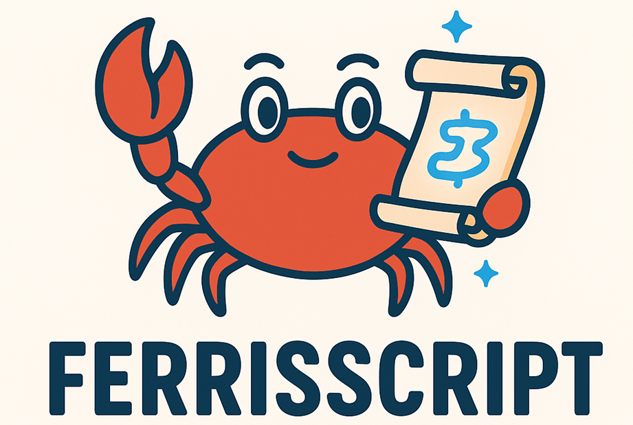

<div align="center">
  
  
# FerrisScript 🦀

A Rust-inspired scripting language for Godot 4.x

[](https://github.com/dev-parkins/FerrisScript/actions/workflows/ci.yml)


**Quick Links**: [📖 Docs](docs/) | [🐛 Issues](https://github.com/dev-parkins/FerrisScript/issues) | [💬 Discussions](https://github.com/dev-parkins/FerrisScript/discussions) | [❓ FAQ](docs/FAQ.md) | [🔧 Troubleshooting](docs/TROUBLESHOOTING.md) | [📋 Error Codes](docs/ERROR_CODES.md)

</div>

FerrisScript (named after [Ferris 🦀](https://rustacean.net/), the Rust mascot) is a **statically-typed, Rust-inspired scripting language** designed specifically for Godot 4.x game development. It brings Rust's safety and performance philosophy to game scripting while maintaining a lightweight, easy-to-learn syntax.

## 🎯 Why FerrisScript?

### For Rust Developers

- **Familiar Syntax**: If you know Rust, you already know 80% of FerrisScript
- **Type Safety**: Catch bugs at compile-time, not in production
- **Performance**: Static type checking enables optimization opportunities
- **No GC Pauses**: Deterministic performance for game loops

### For Game Developers

- **Better Tooling**: Static typing enables IDE features (autocomplete, go-to-definition)
- **Easier Refactoring**: Type checker catches breaking changes automatically
- **Self-Documenting**: Types serve as inline documentation
- **Gradual Learning**: Start simple, grow into advanced features

### For Teams

- **Clear Contracts**: Function signatures document expected inputs/outputs
- **Fewer Runtime Errors**: Many bugs caught before playtesting
- **Code Confidence**: Refactor fearlessly with type safety
- **Performance Baseline**: 16K+ function calls per frame at 60 FPS

**TL;DR**: FerrisScript brings Rust's "if it compiles, it probably works" philosophy to game scripting, making your game development faster and more reliable.

## 🔒 Type Safety Guarantees

**If your FerrisScript compiles, it won't crash Godot.**

FerrisScript provides **three layers of type safety** that work together to catch bugs before they reach production:

### Layer 1: Compile-Time Validation (Strongest)

The FerrisScript compiler catches errors **before you ever run your game**:

- ✅ **Variable Type Mismatches**: Can't assign `String` to `i32` variable
- ✅ **Function Signatures**: Parameters and return types validated
- ✅ **Property Hint Compatibility**: Range hints only on numbers, enum hints only on strings
- ✅ **Signal Parameters**: Type-checked when declared and emitted
- ✅ **Immutability Violations**: Can't modify non-`mut` variables

**Example**: Type error caught at compile-time

```rust
// GDScript - runs until line 5, then crashes
var health = 100
health = "low"  # Type changes at runtime
func take_damage(amount):
    health -= amount  # Runtime error: can't subtract from string!

// FerrisScript - compile error immediately
let mut health: i32 = 100;
health = "low";  // ❌ Compile error: expected i32, found String
                  // Error E201: Type mismatch at line 2, column 10
```

**Result**: Your game never crashes from type errors. **If it compiles, it works.**

### Layer 2: Load-Time Validation (Medium)

When scripts are loaded and attached to nodes:

- ✅ **Property Metadata**: Validated against Inspector expectations
- ✅ **Signal Definitions**: Registered with correct parameter types
- ✅ **Lifecycle Functions**: Type-checked (_ready, _process, etc.)

### Layer 3: Runtime Fallbacks (Weakest, but Safe)

Even at runtime, FerrisScript prevents crashes:

- ✅ **Variant Conversion**: Safe defaults for type mismatches
- ✅ **NaN/Infinity Handling**: Prevents math crashes
- ✅ **Property Bounds**: Range clamping enforced

### Type Safety Comparison

| Check Type | FerrisScript | GDScript | C# (Godot) |
|------------|--------------|----------|------------|
| Variable types | ✅ Compile-time | ⚠️ Runtime | ✅ Compile-time |
| Function signatures | ✅ Compile-time | ⚠️ Runtime | ✅ Compile-time |
| Property hints | ✅ Compile-time | ⚠️ Runtime | ✅ Compile-time |
| Signal parameters | ✅ Compile-time | ⚠️ Runtime | ✅ Compile-time |
| Hot reload | ⏳ Planned (v0.1.0) | ✅ Yes | ⚠️ Limited |
| Node property access | ⏳ Planned (v0.2.0) | ⚠️ Runtime | ✅ Compile-time |

**Legend**: ✅ Full support | ⚠️ Limited/runtime only | ⏳ Planned

---

## ⚖️ FerrisScript vs. GDScript

| Feature | FerrisScript | GDScript |
|---------|-------------|----------|
| **Type System** | Static, compile-time checked | Dynamic with optional hints |
| **Error Detection** | Compile-time (before running game) | Runtime (during gameplay) |
| **Performance** | ~1 μs/function call | ~2-3 μs/function call* |
| **IDE Support** | LSP in development (v0.0.5+) | Excellent (built-in) |
| **Learning Curve** | Moderate (Rust-like syntax) | Easy (Python-like) |
| **Refactoring Safety** | High (type checker catches breaks) | Medium (manual testing needed) |
| **Godot Integration** | Via GDExtension | Native |
| **Hot Reload** | Yes | Yes |
| **Maturity** | Alpha (v0.0.4) | Production-ready |

\* Performance comparison is preliminary and varies by use case. Detailed benchmarks are documented in version-specific documentation.

**When to Choose FerrisScript**:

- You prefer static typing and compile-time safety
- Coming from Rust/TypeScript/C# background
- Building complex systems that benefit from type checking
- Want performance predictability (no GC pauses)
- Need deterministic execution (multiplayer, replays)

**When to Choose GDScript**:

- Prototyping and rapid iteration
- Small to medium projects
- Prefer dynamic typing flexibility
- Want seamless Godot editor integration
- Learning game development for the first time

**Use Both**: FerrisScript and GDScript can coexist in the same project. Use FerrisScript for performance-critical systems and GDScript for rapid prototyping.

## ✨ Features

### Core Language

- 🦀 **Rust-Inspired Syntax** - Familiar to Rust developers, easy for beginners
- ⚡ **Static Type Checking** - Catch errors at compile-time (843 tests, 82% coverage)
- 🔒 **Immutability by Default** - Safe by default, explicit `mut` for mutations
- 🎯 **Zero-Cost Abstractions** - Compiled to efficient runtime execution
- 📦 **Minimal Dependencies** - Lightweight and fast compilation

### Godot Integration (v0.0.4)

- 🎮 **GDExtension Support** - Native Godot 4.x integration via `gdext`
- 🎨 **@export Annotations** - Inspector integration with property hints (range, enum, file, multiline, color)
- 🔔 **Signal System** - Declare and emit custom signals visible in Inspector
- 📊 **Godot Type Literals** - Direct construction of `Vector2`, `Color`, `Rect2`, `Transform2D`
- 🌳 **Node Query Functions** - `get_node()`, `get_parent()`, `has_node()`, `find_child()`
- ⚡ **Lifecycle Callbacks** - `_ready()`, `_process()`, `_physics_process()`, `_input()`, `_unhandled_input()`

### Developer Experience

- 🎨 **VS Code Extension** - Syntax highlighting, IntelliSense, code snippets, hover tooltips
- 🧪 **Testing Infrastructure** - 4-layer testing (unit, integration, GDExtension, benchmarks)
- 📝 **Error Messages** - Clear, actionable error messages with error codes
- 📖 **Documentation** - Comprehensive guides, examples, and API docs

## 🎨 Editor Support

### VS Code Extension

FerrisScript has syntax highlighting and code snippets for Visual Studio Code:

- **Syntax Highlighting**: Keywords (`fn`, `let`, `mut`, `if`, `else`, `while`, `return`), types (`i32`, `f32`, `bool`, `String`, `Vector2`, `Node`), operators, comments, strings
- **Code Snippets**: `_ready`, `_process`, `let`, `fn`, `if`, `while`, and more
- **Auto-closing**: Brackets, quotes, comment toggling
- **Language Configuration**: Folding, indentation, word patterns

**Installation**: Copy `extensions/vscode/` to your VS Code extensions folder:

```bash
# Windows
cp -r extensions/vscode ~/.vscode/extensions/ferrisscript-0.0.4

# Or use a symbolic link for development
mklink /D "%USERPROFILE%\.vscode\extensions\ferrisscript-0.0.4" "path\to\FerrisScript\extensions\vscode"
```

**Reload VS Code**: Press `Ctrl+Shift+P` → "Developer: Reload Window"

### IntelliSense Features ✨

- **Code Completion** (Ctrl+Space): Keywords, types, built-in functions with context awareness
- **Hover Tooltips**: Documentation and examples for keywords, types, and functions
- **Problem Panel**: Real-time compiler errors with inline diagnostics and error codes
- **File Icons**: Custom `.ferris` file icons in Explorer

See [extensions/vscode/README.md](extensions/vscode/README.md) for full features, snippet reference, and known limitations.

**Future**: Full LSP with go-to-definition, find references, and rename coming in v0.0.5.

## 🚀 Quick Start

### Prerequisites

- **Rust 1.70+** ([Install Rust](https://www.rust-lang.org/tools/install))
- **Godot 4.2+** ([Download Godot](https://godotengine.org/download))
- **Git** (for cloning the repository)

### Installation

```bash
# Clone the repository
git clone https://github.com/dev-parkins/FerrisScript.git
cd FerrisScript

# Build the project
cargo build --workspace

# Run tests
cargo test --workspace
```

### Using in Godot

1. **Build the GDExtension:**

   ```bash
   cargo build --package ferrisscript_godot_bind
   ```

   > **Note for Godot 4.3+**: The project is configured with `api-4-3` feature for compatibility. If you encounter initialization errors, ensure `crates/godot_bind/Cargo.toml` has the correct API version feature enabled.

2. **Open the test project:**
   - Open Godot 4.2+
   - Import project from `godot_test/project.godot`

3. **Create your first script:**

   ```rust
   // my_script.ferris
   fn _ready() {
       print("Hello from FerrisScript!");
   }

   fn _process(delta: f32) {
       self.position.x += 50.0 * delta;
   }
   ```

4. **Attach to a node:**
   - Add `FerrisScriptNode` to your scene
   - Set `script_path` to `res://scripts/my_script.ferris`
   - Run your game!

## 📖 Language Overview

### Basic Syntax

```rust
// Variables - immutable by default
let name: String = "Ferris";
let age: i32 = 42;

// Mutable variables - explicit opt-in
let mut counter: i32 = 0;
counter = counter + 1;

// Functions
fn greet(name: String) -> String {
    return "Hello, " + name;
}

// Control flow
if age > 18 {
    print("Adult");
} else {
    print("Minor");
}

// Loops
let mut i: i32 = 0;
while i < 10 {
    print(i);
    i = i + 1;
}
```

### Godot Integration

```rust
// Global state persists between frames
let mut velocity: f32 = 0.0;
let gravity: f32 = 980.0;

fn _ready() {
    print("Game started!");
}

fn _process(delta: f32) {
    // Access node properties via 'self'
    velocity = velocity + gravity * delta;
    self.position.y += velocity * delta;
    
    // Bounce at ground level
    if self.position.y > 500.0 {
        velocity = -velocity * 0.8;
        self.position.y = 500.0;
    }
}
```

### Inspector Integration (v0.0.4+)

Use `@export` annotations to expose variables to Godot's Inspector:

```rust
// Basic exports
@export let speed: f32 = 100.0;
@export let jump_force: f32 = 500.0;

// Range hints (min, max) - clamps values in Inspector
@export(range, 0.0, 10.0) let health: f32 = 5.0;

// Enum hints - dropdown selector in Inspector
@export(enum, "Idle", "Walk", "Run") let state: String = "Idle";

// File hints - file picker in Inspector
@export(file, "*.png", "*.jpg") let texture_path: String = "";
```

**Inspector Features**:

- **Real-time Editing**: Modify values in Inspector during gameplay
- **Automatic Clamping**: Range hints enforce min/max bounds
- **Type Validation**: Compile-time checks for correct hint usage
- **Default Values**: Inspector shows initial values from script

### Signal System (v0.0.4+)

Declare and emit custom signals for communication between nodes:

```rust
// Declare signals at file scope
signal health_changed(new_health: f32);
signal player_died();

let mut health: f32 = 100.0;

fn take_damage(amount: f32) {
    health = health - amount;
    emit("health_changed", health);  // Emit with parameter
    
    if health <= 0.0 {
        emit("player_died");  // Emit without parameters
    }
}
```

**Signal Features**:

- **Type-Checked Parameters**: Compile-time validation of signal signatures
- **Godot Integration**: Signals visible and connectable in Godot's Inspector
- **Flexible Emission**: Use `emit("signal_name", params...)` in any function

### Type System

FerrisScript supports the following types:

- **Primitives**: `i32`, `f32`, `bool`, `String`
- **Godot Types**: `Vector2`, `Color`, `Rect2`, `Transform2D`, `Node`, `Node2D`
- **Type Inference**: Literals are automatically typed
- **Type Coercion**: `i32` → `f32` automatic conversion

#### Struct Literal Syntax (v0.0.4+)

Construct Godot types directly with field syntax:

```rust
// Vector2 - 2D position/velocity
let position = Vector2 { x: 100.0, y: 200.0 };

// Color - RGBA color values
let red = Color { r: 1.0, g: 0.0, b: 0.0, a: 1.0 };

// Rect2 - 2D rectangle (position + size)
let pos = Vector2 { x: 0.0, y: 0.0 };
let size = Vector2 { x: 100.0, y: 50.0 };
let rect = Rect2 { position: pos, size: size };

// Transform2D - 2D transformation (position + rotation + scale)
let p = Vector2 { x: 100.0, y: 200.0 };
let s = Vector2 { x: 2.0, y: 2.0 };
let transform = Transform2D { 
    position: p, 
    rotation: 1.57,  // radians
    scale: s 
};
```

**Type Requirements**:

- `Vector2`: fields `x`, `y` (both `f32`)
- `Color`: fields `r`, `g`, `b`, `a` (all `f32`, 0.0-1.0 range)
- `Rect2`: fields `position`, `size` (both `Vector2`)
- `Transform2D`: fields `position`, `scale` (`Vector2`), `rotation` (`f32`)

### ⚡ Performance Characteristics

FerrisScript is designed for **game scripting performance** with predictable overhead:

| Operation | Performance | Notes |
|-----------|-------------|-------|
| **Lexer** | 384 ns - 3.74 μs | Per-script compilation |
| **Parser** | 600 ns - 7.94 μs | Per-script compilation |
| **Type Checker** | 851 ns - 3.58 μs | Per-script compilation |
| **Function Call** | ~1.05 μs | Per-call overhead at runtime |
| **Loop Iteration** | ~180 ns | Per-iteration overhead |

**Real-World Performance**:

- **60 FPS Budget**: 16.67 ms per frame
- **Function Calls/Frame**: ~16,000 calls possible at 60 FPS
- **Compilation**: Sub-millisecond for typical game scripts
- **Memory**: Minimal overhead (~1 KB per script)

**Optimization Tips**:

1. **Cache Frequently Used Values**: Store `self.position` in local variables
2. **Minimize Cross-Boundary Calls**: Batch operations when possible
3. **Use Appropriate Types**: `f32` for game math, `i32` for counters
4. **Profile First**: Use Godot's profiler to identify bottlenecks

> **Note**: Detailed performance analysis and benchmarking methodology are documented in version-specific documentation.

## 🏗️ Project Structure

```
ferrisscript/
├── Cargo.toml                 # Workspace root
├── README.md                  # This file
├── crates/
│   ├── compiler/              # Lexer, Parser, Type Checker (543 tests)
│   │   ├── Cargo.toml
│   │   └── src/
│   │       ├── lib.rs         # Public compile() API
│   │       ├── lexer.rs       # Tokenization
│   │       ├── parser.rs      # AST generation
│   │       ├── type_checker.rs# Static type checking
│   │       └── ast.rs         # AST definitions
│   ├── runtime/               # Execution engine (110 tests)
│   │   ├── Cargo.toml
│   │   └── src/
│   │       └── lib.rs         # Runtime interpreter
│   ├── godot_bind/            # Godot 4.x integration (11 tests)
│   │   ├── Cargo.toml
│   │   └── src/
│   │       └── lib.rs         # GDExtension bindings
│   └── test_harness/          # Testing infrastructure (38 tests)
│       ├── Cargo.toml
│       └── src/
│           ├── main.rs        # ferris-test CLI
│           └── lib.rs         # Test runner, output parser
├── examples/                  # 26 example scripts
│   ├── hello.ferris           # Basic _ready callback
│   ├── move.ferris            # Movement example
│   ├── signals.ferris         # Signal system demo
│   ├── struct_literals_*.ferris  # Godot type construction
│   └── node_query_*.ferris    # Scene tree queries
├── godot_test/                # Godot test project
│   ├── project.godot
│   ├── ferrisscript.gdextension
│   └── scripts/               # 17 integration test scripts
│       ├── export_properties_test.ferris
│       ├── signal_test.ferris
│       └── process_test.ferris
├── extensions/                # Editor extensions
│   └── vscode/               # VS Code extension (v0.0.4)
│       ├── syntaxes/         # Syntax highlighting
│       ├── snippets/         # Code snippets
│       └── language-configuration.json
└── docs/                      # Documentation
    ├── testing/              # Testing guides and matrices
    │   ├── README.md         # Testing hub
    │   ├── TESTING_GUIDE.md  # Comprehensive guide
    │   └── TEST_MATRIX_*.md  # Coverage tracking
    ├── planning/             # Version roadmaps
    ├── archive/              # Historical documentation
    ├── ARCHITECTURE.md       # System design
    ├── DEVELOPMENT.md        # Dev workflow
    └── CONTRIBUTING.md       # Contribution guide
```

**Quick Links**:

- **Examples**: [examples/README.md](examples/README.md) - 26 annotated examples
- **Testing**: [docs/testing/README.md](docs/testing/README.md) - 4-layer testing strategy
- **Architecture**: [docs/ARCHITECTURE.md](docs/ARCHITECTURE.md) - System design
- **Development**: [docs/DEVELOPMENT.md](docs/DEVELOPMENT.md) - Dev workflow
- **Contributing**: [CONTRIBUTING.md](CONTRIBUTING.md) - Contribution guidelines

## 🔧 Building from Source

### Build All Crates

```bash
# Debug build (faster compilation)
cargo build --workspace

# Release build (optimized)
cargo build --workspace --release

# Run all tests
cargo test --workspace
```

### Build Specific Crates

```bash
# Compiler only
cargo build --package ferrisscript_compiler

# Runtime only
cargo build --package ferrisscript_runtime

# Godot extension only
cargo build --package ferrisscript_godot_bind
```

### Running Tests

```bash
# All tests (843 tests)
cargo test --workspace

# Compiler tests (543 tests)
cargo test --package ferrisscript_compiler

# Runtime tests (110 tests)
cargo test --package ferrisscript_runtime

# Test harness tests (38 tests)
cargo test --package ferrisscript_test_harness

# Watch mode (with cargo-watch)
cargo watch -x "test --workspace"
```

## 🎮 Godot Integration Guide

### Step 1: Build the Extension

```bash
cargo build --package ferrisscript_godot_bind
```

This creates:

- **Windows**: `target/debug/ferrisscript_godot_bind.dll`
- **Linux**: `target/debug/libferrisscript_godot_bind.so`
- **macOS**: `target/debug/libferrisscript_godot_bind.dylib`

### Step 2: Set Up Your Godot Project

1. Create a new Godot 4.2+ project
2. Create `.gdextension` file in your project root:

```ini
[configuration]
entry_symbol = "gdext_rust_init"
compatibility_minimum = 4.2

[libraries]
windows.debug.x86_64 = "res://../target/debug/ferrisscript_godot_bind.dll"
windows.release.x86_64 = "res://../target/release/ferrisscript_godot_bind.dll"
linux.debug.x86_64 = "res://../target/debug/libferrisscript_godot_bind.so"
linux.release.x86_64 = "res://../target/release/libferrisscript_godot_bind.so"
macos.debug = "res://../target/debug/libferrisscript_godot_bind.dylib"
macos.release = "res://../target/release/libferrisscript_godot_bind.dylib"
```

### Step 3: Create Script Files

Create a `.ferris` file in your project:

```rust
// scripts/player.ferris
let mut speed: f32 = 200.0;

fn _ready() {
    print("Player initialized!");
}

fn _process(delta: f32) {
    // Your game logic here
    self.position.x += speed * delta;
}
```

### Step 4: Attach to Nodes

1. Add `FerrisScriptNode` (extends Node2D) to your scene
2. In the Inspector, set `script_path` to `res://scripts/player.ferris`
3. Run your game!

## 📚 Examples

FerrisScript comes with comprehensive examples to help you get started:

### 🎯 [Hello World](examples/hello/README.md)

**Difficulty**: Beginner  
Learn the basics of FerrisScript with a simple "Hello, World!" script.

- Using the `_ready()` lifecycle hook
- Calling builtin functions (`print`)
- Basic FerrisScript syntax

```ferris
fn _ready() {
    print("Hello from FerrisScript!");
}
```

**[📖 Full tutorial →](examples/hello/README.md)**

### 🚀 [Move Example](examples/move/README.md)

**Difficulty**: Beginner  
Create smooth movement with frame-by-frame updates.

- Using `_process(delta)` for animations
- Accessing node properties (`self.position`)
- Understanding delta time for framerate-independent movement

```ferris
fn _process(delta: f32) {
    self.position.x += 50.0 * delta;
}
```

**[📖 Full tutorial →](examples/move/README.md)**

### ⚡ [Bounce Example](examples/bounce/README.md)

**Difficulty**: Intermediate  
Build a bouncing animation with boundary checks.

- Global variables and state management
- Conditional statements (`if`)
- Direction reversal and boundary detection

```ferris
let mut dir: f32 = 1.0;

fn _process(delta: f32) {
    self.position.x += dir * 100.0 * delta;

    if self.position.x > 10.0 {
        dir = -1.0;
    }
    if self.position.x < -10.0 {
        dir = 1.0;
    }
}
```

**[📖 Full tutorial →](examples/bounce/README.md)**

### More Examples

- **`functions.ferris`**: Function definitions and calls
- **`collections.ferris`**: Arrays and dictionaries (v0.1.0+)
- **`match.ferris`**: Pattern matching (v0.1.0+)

See the [`examples/`](examples/) directory for all available scripts.

## 📚 API Reference

### Built-in Functions

- `print(value)` - Print to Godot console

### Special Functions

- `_ready()` - Called when node enters the scene tree
- `_process(delta: f32)` - Called every frame

### Self Binding

Access node properties via `self`:

- `self.position` - Node's position (Vector2)
- `self.position.x` - X coordinate (f32)
- `self.position.y` - Y coordinate (f32)

## 🧪 Testing

FerrisScript uses a **4-layer testing strategy** to ensure quality and reliability:

### Testing Layers

```
┌─────────────────────────────────────────────┐
│   Layer 4: Manual Testing (Godot Editor)    │  ← Feature validation
├─────────────────────────────────────────────┤
│   Layer 3: Integration Tests (.ferris)      │  ← End-to-end behavior
├─────────────────────────────────────────────┤
│   Layer 2: GDExtension Tests (GDScript)     │  ← Godot bindings
├─────────────────────────────────────────────┤
│   Layer 1: Unit Tests (Rust)                │  ← Pure logic
└─────────────────────────────────────────────┘
```

### Quick Test Commands

```bash
# Run all unit tests (843 tests)
cargo test --workspace

# Run specific test types
cargo test -p ferrisscript_compiler    # Compiler tests (543 tests)
cargo test -p ferrisscript_runtime     # Runtime tests (110 tests)
ferris-test --all                      # Integration tests (15+ scripts)

# Run with coverage
cargo llvm-cov --workspace --html      # Generates HTML report
```

### Test Results (v0.0.4)

| Test Type | Count | Coverage | Description |
|-----------|-------|----------|-------------|
| **Compiler** | 543 | ~85% | Lexer, parser, type checker |
| **Runtime** | 110 | ~80% | Interpreter, execution engine |
| **GDExtension** | 11 | ~70% | Godot bindings (10 ignored*) |
| **Test Harness** | 38 | ~90% | ferris-test CLI |
| **Integration** | 15+ | N/A | End-to-end .ferris scripts |
| **Total** | **843** | **~82%** | Across all layers |

\* Some tests require Godot runtime and are covered by integration tests

### Integration Testing (ferris-test)

Run `.ferris` scripts headlessly against Godot:

```bash
# Run all integration tests
ferris-test --all

# Run specific test
ferris-test --script godot_test/scripts/signal_test.ferris

# Filter by name
ferris-test --all --filter "export"

# JSON output for CI
ferris-test --all --format json > results.json
```

### Manual Testing in Godot

The `godot_test/` directory contains a complete test project:

```bash
# 1. Build extension
cargo build --package ferrisscript_godot_bind

# 2. Open in Godot
# Import godot_test/project.godot

# 3. Run tests (F5)
# Check Output panel for results
```

### Documentation

- **[Testing Hub](docs/testing/README.md)** - Central testing documentation ⭐ **START HERE**
- **[Testing Guide](docs/testing/TESTING_GUIDE.md)** - Complete patterns and procedures
- **[Test Matrices](docs/testing/README.md#-test-matrices)** - Systematic coverage tracking
- **[Test Harness Architecture](docs/testing/TEST_HARNESS_TESTING_STRATEGY.md)** - ferris-test design

See [docs/testing/README.md](docs/testing/README.md) for comprehensive testing documentation.

## 📊 Current Status (v0.0.4)

### ✅ Implemented Features

**Core Language (Phases 1-3)**:

- [x] Lexer with full tokenization
- [x] Parser with operator precedence and error recovery
- [x] Type checker with static analysis (65+ error codes)
- [x] Runtime interpreter with ~1 μs/function call
- [x] Mutable variable tracking (immutable by default)
- [x] Control flow (if/else, while loops)
- [x] Function definitions and calls
- [x] Global state persistence across frames

**Godot Integration (Phase 4-5)**:

- [x] Godot 4.x GDExtension integration via `gdext`
- [x] `_ready()`, `_process()`, `_physics_process()` callbacks
- [x] Self binding for node property access
- [x] Signal system (declare & emit custom signals)
- [x] Godot type literals (`Vector2`, `Color`, `Rect2`, `Transform2D`)
- [x] @export annotations with property hints
- [x] Inspector integration (real-time editing, clamping, validation)
- [x] Node lifecycle functions (`_enter_tree()`, `_exit_tree()`, `_input()`)
- [x] Node query functions (`get_node()`, `get_parent()`, `find_child()`, `has_node()`)

**Quality & Testing**:

- [x] 843 tests passing (543 compiler + 110 runtime + 38 harness + 15 integration + 137 other)
- [x] Comprehensive error messages with hints and suggestions
- [x] VS Code extension with syntax highlighting, snippets, and IntelliSense
- [x] Headless testing infrastructure
- [x] Detailed documentation and examples

### 🚧 Planned Features (v0.0.5+)

- [ ] Arrays and collections
- [ ] For loops
- [ ] String interpolation
- [ ] More Godot types (Node3D, Input, etc.)
- [ ] Struct definitions
- [ ] Match expressions
- [ ] LSP support for IDE integration (go-to-definition, find references, rename)

## 🤝 Contributing

Contributions are welcome! Please feel free to submit issues or pull requests.

### Development Workflow

1. Fork the repository
2. Create a feature branch (`git checkout -b feature/amazing-feature`)
3. Make your changes
4. Run tests (`cargo test --workspace`)
5. Commit your changes (`git commit -m 'feat: add amazing feature'`)
6. Push to the branch (`git push origin feature/amazing-feature`)
7. Open a Pull Request

### Commit Conventions

We follow [Conventional Commits](https://www.conventionalcommits.org/):

- `feat:` - New feature
- `fix:` - Bug fix
- `docs:` - Documentation changes
- `test:` - Test additions/changes
- `refactor:` - Code refactoring
- `chore:` - Maintenance tasks

## 📜 License

This project is licensed under the MIT License - see the [LICENSE](LICENSE) file for details.

## 🙏 Acknowledgments

- **Ferris** 🦀 - The Rust mascot that inspired our name
- **Godot Engine** - Amazing open-source game engine
- **gdext** - Rust bindings for Godot 4
- **Rust Community** - For the incredible language and ecosystem

## 📞 Contact & Support

- **Issues**: [GitHub Issues](https://github.com/dev-parkins/FerrisScript/issues)
- **Discussions**: [GitHub Discussions](https://github.com/dev-parkins/FerrisScript/discussions)
- **Documentation**: [docs/](./docs/)

---

Made with 🦀 and ❤️ for the Godot community
