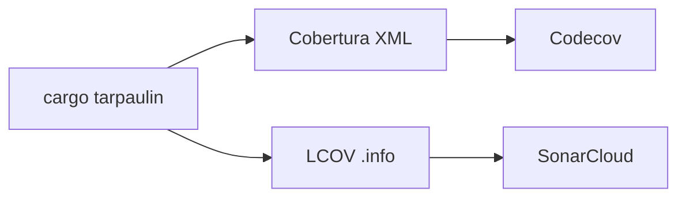

# SonarCloud Coverage Integration for FerrisScript

**Date**: October 8, 2025  
**Status**: ⚠️ LIMITATION DISCOVERED - SonarCloud does NOT support Rust  
**Version**: v0.0.4 (post-v0.0.3 enhancement)

---

## 🚨 CRITICAL UPDATE (October 8, 2025)

**DISCOVERY**: SonarCloud does **NOT** natively support Rust language.

**Impact**:

- ❌ SonarCloud cannot analyze Rust code for quality issues
- ❌ SonarCloud cannot consume Rust coverage reports (LCOV or otherwise)
- ❌ Property `sonar.rust.lcov.reportPaths` does not exist
- ✅ Codecov remains the primary and ONLY coverage tool for Rust code

**Resolution**: This document is kept for historical reference. See:

- **`docs/COVERAGE_STRATEGY.md`** - Current coverage strategy (Codecov for Rust)
- **`docs/planning/technical/SONARCLOUD_RUST_LIMITATION_ANALYSIS.md`** - Full analysis
- **`docs/planning/v0.0.4/SONARCLOUD_COVERAGE_INVESTIGATION_SUMMARY.md`** - Investigation summary

---

## 🎯 Overview (Historical)

This document describes the **attempted** integration of code coverage reporting into SonarCloud for FerrisScript's Rust codebase.

**Original Goal**: Enable SonarCloud to receive and display code coverage metrics alongside quality metrics.

**Original Approach**: Low-effort LCOV integration (assumed native SonarCloud support for Rust).

**Actual Result**: SonarCloud does not support Rust language, making this integration impossible.

---

## 📊 Coverage Tool Chain

### Current Coverage Reporting (Dual Integration)



**Tools**:

1. **cargo-tarpaulin**: Rust code coverage tool (installed in CI)
2. **Cobertura XML**: Format for Codecov (existing integration)
3. **LCOV**: Format for SonarCloud (newly added)

**Benefit**: Both services receive coverage data with no duplication of effort.

---

## 🔧 Implementation Details

### 1. CI Workflow Changes

**File**: `.github/workflows/code-scanning.yml`

**Before**:

```yaml
- name: Generate coverage
  run: cargo tarpaulin --workspace --out Xml --output-dir coverage
```

**After**:

```yaml
- name: Generate coverage
  run: cargo tarpaulin --workspace --out Xml --out Lcov --output-dir coverage
```

**Change**: Added `--out Lcov` flag to generate `coverage/lcov.info` file.

**Impact**:

- ✅ No additional CI time (both formats generated in single run)
- ✅ No additional storage cost (LCOV file is small)
- ✅ Maintains existing Codecov integration (Cobertura still generated)

---

### 2. SonarCloud Configuration

**File**: `sonar-project.properties`

**Added**:

```properties
# Coverage report paths (LCOV format for Rust)
# Generated by cargo-tarpaulin in CI (code-scanning.yml)
sonar.rust.lcov.reportPaths=coverage/lcov.info
```

**What This Does**:

- Tells SonarCloud where to find coverage data
- Uses LCOV format (natively supported for Rust)
- Path is relative to repository root

---

## 📋 Verification Steps

### After Next CI Run

1. **Check SonarCloud Dashboard**:
   - Navigate to: <https://sonarcloud.io/project/overview?id=dev-parkins_FerrisScript>
   - Look for "Coverage" metric (should show ~64%)
   - Quality gate status may change based on coverage thresholds

2. **Verify LCOV File Generation**:
   - Check CI logs for `coverage/lcov.info` creation
   - Confirm file exists in coverage job artifacts

3. **Compare with Codecov**:
   - Codecov: <https://codecov.io/gh/dev-parkins/FerrisScript>
   - SonarCloud coverage should match Codecov (both ~64%)

---

## 🔍 Format Comparison

### LCOV vs. Cobertura

| Feature | LCOV | Cobertura |
|---------|------|-----------|
| **Format** | Line-based text | XML |
| **Coverage Types** | Line, function | Line, branch, statement |
| **SonarCloud Support** | ✅ Native (Rust) | ⚠️ Limited (Java/Python) |
| **Codecov Support** | ✅ Supported | ✅ Preferred |
| **File Size** | Small (~50KB) | Medium (~200KB) |
| **Human Readable** | Yes | No (XML) |

**Why LCOV for SonarCloud**:

- SonarCloud expects LCOV for Rust projects (per documentation)
- No conversion/parsing needed
- Low effort, high reliability

**Why Cobertura for Codecov**:

- Codecov prefers Cobertura for richer metrics (branch coverage)
- Already configured and working

---

## 🎯 Coverage Goals by Version

### v0.0.3 (Current)

- ✅ **64.54%** overall coverage
- ✅ Excellent coverage on new features (error system 99%+)
- ⚠️ Known gaps: Godot (0%), AST (13.4%), Lexer (60.8%)

### v0.0.4 (Target)

- 🎯 **70-75%** overall coverage
- Focus: Godot integration tests (0% → 60%)
- Focus: Lexer edge cases (60.8% → 75%)

### v0.1.0 (Target)

- 🎯 **80%+** overall coverage
- Focus: AST display tests (13.4% → 60%)
- Focus: Runtime edge cases (60.2% → 75%)
- Focus: Type checker complex scenarios (68% → 80%)

---

## 🔗 Related Resources

### Documentation

- [Coverage Analysis (v0.0.3)](../v0.0.3/COVERAGE_ANALYSIS.md)
- [Post-Release Improvements](../v0.0.3/POST_RELEASE_IMPROVEMENTS.md)
- [v0.0.4 Roadmap](../v0.0.4-roadmap.md)

### External Resources

- [SonarCloud Test Coverage](https://docs.sonarsource.com/sonarcloud/enriching/test-coverage/test-coverage-parameters/)
- [cargo-tarpaulin Documentation](https://github.com/xd009642/tarpaulin)
- [LCOV Format Specification](https://github.com/linux-test-project/lcov)

### Code References

- CI Workflow: `.github/workflows/code-scanning.yml`
- SonarCloud Config: `sonar-project.properties`

---

## 🚨 Troubleshooting

### Issue: SonarCloud Not Showing Coverage

**Symptoms**: Quality gate passes but coverage shows 0% or "N/A"

**Causes**:

1. LCOV file not generated (check CI logs)
2. Wrong file path in `sonar-project.properties`
3. SonarQube scanner ran before coverage job completed
4. Coverage file not uploaded to scanner

**Solutions**:

1. Verify `cargo tarpaulin --out Lcov` runs successfully
2. Check `coverage/lcov.info` exists in CI artifacts
3. Ensure coverage job runs before SonarQube job (dependency)
4. Verify `sonar.rust.lcov.reportPaths` path is correct

### Issue: Coverage Mismatch Between Codecov and SonarCloud

**Symptoms**: Codecov shows 64%, SonarCloud shows 60%

**Causes**:

1. Different coverage calculation methods (line vs. branch)
2. Excluded files differ between tools
3. LCOV vs. Cobertura format differences

**Solutions**:

1. Small differences (±5%) are normal and acceptable
2. Both tools use same source data (tarpaulin)
3. Focus on trends, not absolute numbers

### Issue: CI Job Fails After Adding LCOV

**Symptoms**: `cargo tarpaulin --out Lcov` fails

**Causes**:

1. Older version of tarpaulin doesn't support `--out Lcov`
2. Conflicting output formats

**Solutions**:

1. Update tarpaulin: `cargo install cargo-tarpaulin --force`
2. Check tarpaulin version: `cargo tarpaulin --version` (need 0.20+)

---

## 📊 Expected SonarCloud Quality Gate Impact

### Before Integration

- ✅ Code Smells: A (0 issues)
- ✅ Security Hotspots: A (0 issues)
- ⚠️ Coverage: N/A (no data)
- ⚠️ Quality Gate: May fail due to missing coverage

### After Integration

- ✅ Code Smells: A (0 issues)
- ✅ Security Hotspots: A (0 issues)
- ✅ Coverage: 64.54%
- ✅ Quality Gate: Should pass (if threshold ≤65%)

**Note**: SonarCloud default coverage threshold is typically 80% for new code. We may need to adjust this for alpha releases.

---

## 🎉 Success Criteria

**This integration is successful when**:

- [x] CI generates `coverage/lcov.info` file
- [x] SonarCloud configuration updated with LCOV path
- [ ] SonarCloud dashboard shows coverage percentage (verify after next CI run)
- [ ] Coverage matches Codecov within ±5%
- [ ] Quality gate reflects actual coverage status
- [ ] No breaking changes to existing Codecov integration

**Next Steps** (After Verification):

1. Monitor SonarCloud dashboard after next develop push
2. Adjust quality gate thresholds if needed
3. Document any issues in TROUBLESHOOTING.md
4. Update v0.0.4 roadmap with coverage goals

---

## 🔄 Maintenance

### Regular Tasks

- **Weekly**: Check SonarCloud dashboard for coverage trends
- **Per Release**: Update coverage goals in roadmap documents
- **As Needed**: Adjust quality gate thresholds

### Known Limitations

1. **Godot Bind Coverage**: 0% (no tests yet) - affects overall percentage
2. **AST Coverage**: 13.4% (display code) - low impact but affects metrics
3. **SonarCloud Free Tier**: Limited historical data (may lose trends after 30 days)

### Future Enhancements

- [ ] Add coverage badge to README (v0.1.0)
- [ ] Set up coverage alerts for regressions (v0.1.0)
- [ ] Integrate coverage reports into PR comments (v0.0.5)

---

**Last Updated**: October 8, 2025  
**Next Review**: After v0.0.4 release
