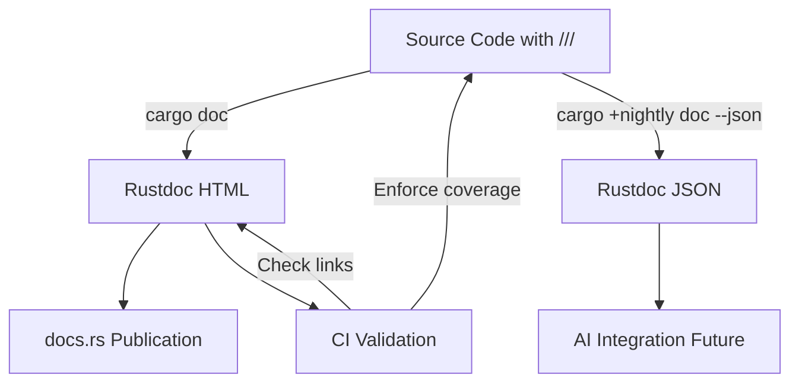
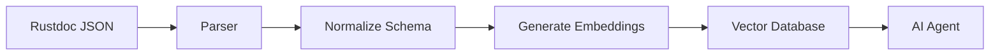

# Rustdoc Implementation Plan for FerrisScript

**Version**: v0.0.5 (or later)  
**Created**: October 13, 2025  
**Status**: Planning  
**Effort Estimate**: 2-3 weeks (Medium complexity)

---

## 📋 Table of Contents

- [Executive Summary](#-executive-summary)
- [Problem Statement](#-problem-statement)
- [Goals & Non-Goals](#-goals--non-goals)
- [Current State Analysis](#-current-state-analysis)
- [Proposed Solution](#-proposed-solution)
- [Implementation Phases](#-implementation-phases)
- [Effort Estimation](#-effort-estimation)
- [Success Criteria](#-success-criteria)
- [Future Enhancements](#-future-enhancements)
- [References](#-references)

---

## 🎯 Executive Summary

**Goal**: Establish comprehensive Rustdoc coverage for all FerrisScript crates to improve:

1. **Developer Onboarding** - New contributors can understand code structure quickly
2. **API Discovery** - Public APIs are clearly documented with examples
3. **Maintenance** - Future developers understand original design intent
4. **Professionalism** - Generated docs at <https://docs.rs/ferrisscript-compiler>

**Approach**: Leverage existing `///` comments (50+ already present), generate JSON output for potential AI integration, and establish CI validation to maintain quality.

**Timeline**: 2-3 weeks across 4 phases

---

## 🎯 Problem Statement

### Current State

FerrisScript has **partial rustdoc coverage**:

- ✅ Some modules have `///` comments (test_harness, report_generator, scene_builder)
- ❌ No workspace-level documentation landing page
- ❌ No `cargo doc` CI validation
- ❌ No published docs on <https://docs.rs>
- ❌ Inconsistent documentation style across crates
- ❌ Missing examples in public API documentation

### Pain Points

1. **Onboarding Friction**: New contributors must read source code to understand APIs
   - No high-level overview of compiler pipeline
   - No runtime architecture explanation
   - No Godot binding usage examples

2. **Maintenance Burden**: Original design intent not captured
   - Why was error recovery implemented this way?
   - What's the relationship between AST, TypeChecker, and Runtime?
   - How do lifecycle functions integrate with Godot?

3. **API Discoverability**: Hard to find the right function/struct
   - No searchable documentation
   - No cross-references between related types
   - No examples showing typical usage patterns

4. **Lost Opportunity**: Rustdoc JSON could power AI coding assistants
   - Could generate embeddings for semantic search
   - Could auto-complete based on documented APIs
   - Could validate usage examples automatically

---

## 🎯 Goals & Non-Goals

### Goals

1. **Comprehensive Coverage**: Every public item documented with `///` comments
   - Modules, structs, enums, traits, functions
   - Private items documented with `//` for maintainers

2. **Consistent Style**: Follow Rust documentation conventions
   - Summary sentence (one line, ends with period)
   - Detailed explanation (paragraphs)
   - Examples for complex APIs
   - Links to related items

3. **CI Integration**: Automated validation
   - `cargo doc --workspace --no-deps` must succeed
   - Missing docs treated as warnings (enforced in CI)
   - Link checking for `[crate::module::Type]` references

4. **Published Docs**: Available on <https://docs.rs>
   - Crates published to crates.io (when ready)
   - Docs auto-generated on publish
   - README integrated as crate-level docs

5. **JSON Export**: Rustdoc JSON for AI integration (future)
   - `cargo +nightly doc -- -Z unstable-options --output-format json`
   - Enables semantic search and embeddings
   - Powers intelligent code completion

### Non-Goals

1. ❌ **User-facing tutorials** - Those belong in `docs/` markdown files
2. ❌ **Architecture documentation** - Keep in `docs/ARCHITECTURE.md`
3. ❌ **Full AI integration** - Just enable it, don't build it yet
4. ❌ **Mdbook generation** - Use `cargo doc`, not custom tooling
5. ❌ **External dependency docs** - `--no-deps` flag excludes them

---

## 📊 Current State Analysis

### Documentation Coverage Audit

| Crate                     | Public Items | Documented | Coverage | Quality |
| ------------------------- | ------------ | ---------- | -------- | ------- |
| `ferrisscript_compiler`   | ~80          | ~15        | ~19%     | 🟡 Fair |
| `ferrisscript_runtime`    | ~50          | ~10        | ~20%     | 🟡 Fair |
| `ferrisscript_godot_bind` | ~30          | ~5         | ~17%     | 🟠 Poor |
| `ferrisscript_test_harness` | ~40        | ~25        | ~63%     | 🟢 Good |

**Overall**: ~25% coverage (50 documented out of ~200 public items)

### Existing Documentation Patterns

**Good Examples** (to replicate):

```rust
/// Results grouped by test category.
///
/// Organizes test results into unit tests, integration tests, and error demos.
pub struct CategoryResults {
    pub unit_tests: Vec<TestResult>,
    pub integration_tests: Vec<TestResult>,
    pub error_demos: Vec<TestResult>,
}
```

**Missing Documentation** (needs attention):

```rust
// ❌ No docs
pub struct Lexer {
    input: String,
    position: usize,
}

// ✅ Should be:
/// Tokenizes FerrisScript source code into a stream of tokens.
///
/// The lexer performs lexical analysis, converting raw text into
/// structured tokens for the parser. It handles:
/// - Keywords (`fn`, `let`, `struct`, etc.)
/// - Operators (`+`, `-`, `==`, etc.)
/// - Literals (numbers, strings, booleans)
/// - Comments (ignored)
///
/// # Example
/// ```
/// use ferrisscript_compiler::Lexer;
///
/// let source = "let x: i32 = 42;";
/// let mut lexer = Lexer::new(source);
/// let tokens = lexer.tokenize()?;
/// ```
pub struct Lexer {
    input: String,
    position: usize,
}
```

### Workspace Configuration

**Current `Cargo.toml` metadata**:

```toml
[workspace.package]
version = "0.0.4"
edition = "2021"
authors = ["FerrisScript Contributors"]
license = "MIT"
```

**Missing metadata** (needed for docs.rs):

```toml
[workspace.package]
version = "0.0.4"
edition = "2021"
authors = ["FerrisScript Contributors"]
license = "MIT"
homepage = "https://github.com/dev-parkins/FerrisScript"
repository = "https://github.com/dev-parkins/FerrisScript"
documentation = "https://docs.rs/ferrisscript-compiler"
readme = "README.md"
keywords = ["gamedev", "godot", "scripting", "compiler", "rust"]
categories = ["game-development", "parser-implementations"]
```

---

## 🛠 Proposed Solution

### Architecture Overview



### Documentation Structure

**Crate-Level Documentation** (`lib.rs`):

```rust
//! # FerrisScript Compiler
//!
//! The FerrisScript compiler translates `.ferris` source files into
//! executable bytecode for the Godot game engine.
//!
//! ## Architecture
//!
//! The compilation pipeline consists of four stages:
//!
//! 1. **Lexical Analysis** ([`Lexer`]): Tokenizes source code
//! 2. **Parsing** ([`Parser`]): Builds an Abstract Syntax Tree (AST)
//! 3. **Type Checking** ([`TypeChecker`]): Validates types and semantics
//! 4. **Code Generation** (future): Emits bytecode
//!
//! ## Example
//!
//! ```no_run
//! use ferrisscript_compiler::{Lexer, Parser, TypeChecker};
//!
//! let source = std::fs::read_to_string("script.ferris")?;
//! let tokens = Lexer::new(&source).tokenize()?;
//! let ast = Parser::new(tokens).parse()?;
//! let checked = TypeChecker::new().check(ast)?;
//! # Ok::<(), Box<dyn std::error::Error>>(())
//! ```
//!
//! ## See Also
//!
//! - [`ferrisscript_runtime`]: Runtime execution engine
//! - [`ferrisscript_godot_bind`]: Godot GDExtension bindings
```

**Module-Level Documentation**:

```rust
//! Error handling and reporting.
//!
//! This module provides structured error types for all compilation stages:
//! - Lexical errors (unexpected characters, unterminated strings)
//! - Syntax errors (missing braces, invalid expressions)
//! - Type errors (type mismatches, undefined variables)
//! - Semantic errors (duplicate declarations, invalid operations)
//!
//! All errors implement [`std::error::Error`] and include:
//! - Human-readable error messages
//! - Source location information (file, line, column)
//! - Suggestions for fixing the error
```

**Item-Level Documentation**:

```rust
/// Parses FerrisScript source code into an Abstract Syntax Tree (AST).
///
/// The parser consumes a token stream from the [`Lexer`] and builds
/// a structured representation of the program. It uses recursive descent
/// parsing with operator precedence for expressions.
///
/// # Error Recovery
///
/// The parser implements panic-mode error recovery, allowing it to
/// continue parsing after encountering errors. This enables reporting
/// multiple errors in a single compilation pass.
///
/// # Example
///
/// ```
/// use ferrisscript_compiler::{Lexer, Parser};
///
/// let source = "fn add(a: i32, b: i32) -> i32 { a + b }";
/// let tokens = Lexer::new(source).tokenize()?;
/// let mut parser = Parser::new(tokens);
/// let program = parser.parse()?;
/// # Ok::<(), Box<dyn std::error::Error>>(())
/// ```
///
/// # Panics
///
/// Panics if internal parser state becomes inconsistent (indicates a bug).
pub struct Parser {
    tokens: Vec<Token>,
    current: usize,
}
```

### Documentation Standards

**Every public item must include**:

1. **Summary** (first line): One sentence, ends with period
2. **Description** (paragraphs): What it does, how it works
3. **Examples** (for complex APIs): Working code snippets
4. **Errors** (if applicable): When does it return `Err`?
5. **Panics** (if applicable): When does it panic?
6. **Safety** (for `unsafe`): Invariants that must be upheld

**Style Guide**:

- Use present tense ("Returns the value" not "Will return")
- Link to related items with `[Type]` or `[module::Type]`
- Use code fences for examples: ` ```rust ` or ` ```no_run `
- Add `# Ok::<(), Error>(())` to make examples compile
- Keep lines under 100 characters for readability

---

## 📋 Implementation Phases

### Phase 1: Foundation Setup (Week 1, Days 1-2)

**Goal**: Configure workspace for documentation generation

#### Tasks

1. **Update `Cargo.toml` metadata** (1 hour)
   - Add homepage, repository, documentation URLs
   - Add keywords and categories for crates.io
   - Add README.md path

2. **Add crate-level docs** (`lib.rs` files) (3 hours)
   - `crates/compiler/src/lib.rs`
   - `crates/runtime/src/lib.rs`
   - `crates/godot_bind/src/lib.rs`
   - `crates/test_harness/src/lib.rs`
   - Include architecture overview, examples, links

3. **Set up doc validation** (2 hours)
   - Add `#![warn(missing_docs)]` to each crate
   - Create `.cargo/config.toml` with doc settings
   - Test `cargo doc --workspace --no-deps`

4. **CI Integration** (2 hours)
   - Add doc generation step to `.github/workflows/ci.yml`
   - Fail CI if docs have warnings
   - Fail CI if `cargo doc` fails

#### Deliverables

- ✅ All 4 crates have crate-level documentation
- ✅ `cargo doc --workspace --no-deps` succeeds
- ✅ CI enforces documentation requirements
- ✅ Workspace metadata complete

#### Acceptance Criteria

- [ ] `cargo doc --workspace --no-deps` generates HTML without warnings
- [ ] CI job "Documentation Check" passes
- [ ] Opening `target/doc/ferrisscript_compiler/index.html` shows crate overview

---

### Phase 2: Compiler Crate Documentation (Week 1, Days 3-5)

**Goal**: Document all public APIs in `ferrisscript_compiler`

#### Modules to Document

1. **`lexer`** (6 hours)
   - `Lexer` struct: Main tokenizer
   - `Token` enum: Token types
   - `TokenKind` enum: Token classification
   - `tokenize()` function: High-level API
   - Examples: Tokenizing a simple script

2. **`parser`** (6 hours)
   - `Parser` struct: Main parser
   - `parse()` method: Entry point
   - `parse_*()` methods: Production rules
   - Error recovery: Panic mode explanation
   - Examples: Parsing expressions, statements

3. **`ast`** (4 hours)
   - `Program`: Top-level AST node
   - `Statement`: Statement variants
   - `Expression`: Expression variants
   - `Type`: Type annotations
   - Visitor pattern explanation

4. **`type_checker`** (6 hours)
   - `TypeChecker` struct: Main type checker
   - `check()` method: Entry point
   - `infer_type()`: Type inference
   - `coerce_types()`: Type coercion rules
   - Examples: Type checking a function

5. **`error_code`** (3 hours)
   - `ErrorCode` enum: All error codes
   - `ErrorCategory`: Error classification
   - `get_docs_url()`: Link to error documentation
   - Examples: Creating and displaying errors

6. **`error_context`** (2 hours)
   - `ErrorContext` struct: Rich error formatting
   - `format_error()`: Human-readable output
   - Source location tracking

#### Documentation Templates

**Struct Template**:

```rust
/// [One-line description ending with period.]
///
/// [Detailed explanation of what this struct represents and when to use it.
/// Include design rationale if non-obvious.]
///
/// # Example
///
/// ```
/// [Working code example showing typical usage]
/// ```
///
/// # See Also
///
/// - [`RelatedType`]: [Why it's related]
pub struct MyStruct {
    /// [Field description]
    pub field: Type,
}
```

**Method Template**:

```rust
/// [One-line description ending with period.]
///
/// [Detailed explanation of what this method does, how it works,
/// and any important behavior.]
///
/// # Parameters
///
/// - `param1`: [What this parameter means]
/// - `param2`: [What this parameter means]
///
/// # Returns
///
/// [What the return value represents]
///
/// # Errors
///
/// Returns `Err` if:
/// - [Condition 1]
/// - [Condition 2]
///
/// # Example
///
/// ```
/// [Working code example]
/// ```
pub fn my_method(&self, param1: Type1, param2: Type2) -> Result<Output, Error> {
    // ...
}
```

#### Deliverables

- ✅ All public items in `ferrisscript_compiler` documented
- ✅ At least 80% documentation coverage
- ✅ All examples compile and run
- ✅ Cross-references between related types

#### Acceptance Criteria

- [ ] `cargo doc -p ferrisscript_compiler` generates complete docs
- [ ] No missing docs warnings
- [ ] All code examples in docs compile: `cargo test --doc -p ferrisscript_compiler`
- [ ] Manual review: docs are clear and helpful

---

### Phase 3: Runtime & Godot Bind Documentation (Week 2, Days 1-3)

**Goal**: Document runtime execution and Godot integration

#### `ferrisscript_runtime` Modules

1. **`runtime`** (5 hours)
   - `Runtime` struct: Execution engine
   - `execute()`: Run a program
   - `Environment`: Variable storage
   - `Value` enum: Runtime values
   - Examples: Executing a simple script

2. **`builtins`** (3 hours)
   - Built-in function registration
   - `print()`, `assert()` functions
   - Godot API wrappers
   - Examples: Calling built-in functions

3. **`lifecycle`** (2 hours)
   - `_ready()`, `_process()`, `_input()` hooks
   - Godot lifecycle integration
   - Examples: Implementing lifecycle functions

#### `ferrisscript_godot_bind` Modules

1. **`gdextension`** (4 hours)
   - `GDExtension` trait: Godot interface
   - FFI bindings: Unsafe wrappers
   - Type mapping: Rust ↔ Godot
   - Examples: Exposing a Rust function to Godot

2. **`property_metadata`** (3 hours)
   - `@export` annotation handling
   - Inspector integration
   - Property hints (range, enum, file)
   - Examples: Exporting properties

3. **`signals`** (2 hours)
   - Signal declaration and emission
   - Godot signal system integration
   - Examples: Defining and emitting signals

#### Deliverables

- ✅ `ferrisscript_runtime` fully documented
- ✅ `ferrisscript_godot_bind` fully documented
- ✅ Examples compile and demonstrate typical usage
- ✅ Godot integration patterns explained

#### Acceptance Criteria

- [ ] `cargo doc -p ferrisscript_runtime` generates complete docs
- [ ] `cargo doc -p ferrisscript_godot_bind` generates complete docs
- [ ] No missing docs warnings in either crate
- [ ] Examples demonstrate real-world usage patterns

---

### Phase 4: Validation & CI Integration (Week 2, Days 4-5)

**Goal**: Ensure documentation quality and maintainability

#### Tasks

1. **Link Validation** (2 hours)
   - Verify all `[crate::module::Type]` links resolve
   - Check for broken cross-references
   - Fix any dead links

2. **Example Testing** (2 hours)
   - Run `cargo test --doc --workspace`
   - Fix failing examples
   - Add `no_run` attribute where appropriate

3. **Coverage Report** (1 hour)
   - Generate documentation coverage statistics
   - Identify remaining undocumented items
   - Document or mark as intentionally private

4. **CI Enhancement** (2 hours)
   - Add `cargo doc` step to CI
   - Add link checking
   - Add coverage threshold (80%+)

5. **Publishing Preparation** (1 hour)
   - Verify crates.io metadata
   - Test `cargo publish --dry-run`
   - Document publishing process

#### Deliverables

- ✅ All links in documentation verified
- ✅ All examples tested and passing
- ✅ CI enforces documentation standards
- ✅ Ready for crates.io publication

#### Acceptance Criteria

- [ ] `cargo test --doc --workspace` passes
- [ ] CI "Documentation Check" job passes
- [ ] Documentation coverage ≥ 80%
- [ ] `cargo publish --dry-run` succeeds for all crates

---

## ⏱ Effort Estimation

### Time Breakdown

| Phase  | Tasks                   | Estimated Time | Complexity |
| ------ | ----------------------- | -------------- | ---------- |
| Phase 1 | Foundation Setup        | 8 hours        | 🟢 Easy    |
| Phase 2 | Compiler Documentation  | 27 hours       | 🟡 Medium  |
| Phase 3 | Runtime & Godot Docs    | 19 hours       | 🟡 Medium  |
| Phase 4 | Validation & CI         | 8 hours        | 🟢 Easy    |
| **Total** | **All Phases**        | **62 hours**   | **🟡 Medium** |

**Calendar Time**: 2-3 weeks (assuming 20-30 hours/week dedicated time)

### Complexity Assessment

**Easy Components** (🟢):

- Crate metadata configuration
- CI integration for doc generation
- Link validation tooling

**Medium Components** (🟡):

- Writing clear, helpful documentation
- Creating working code examples
- Cross-referencing related items
- Maintaining consistency across crates

**Hard Components** (None in this plan):

- N/A - Rustdoc is a well-established tool with good tooling

### Risk Factors

| Risk                         | Probability | Impact | Mitigation                              |
| ---------------------------- | ----------- | ------ | --------------------------------------- |
| Examples don't compile       | Medium      | Medium | Test with `cargo test --doc` early     |
| Inconsistent doc style       | Medium      | Low    | Use templates, review before merging   |
| Links break during refactor  | Low         | Medium | CI link checking catches immediately   |
| CI becomes too slow          | Low         | Low    | Doc generation is fast (~5-10 seconds) |

---

## ✅ Success Criteria

### Quantitative Metrics

- **Documentation Coverage**: ≥ 80% of public items documented
- **Example Pass Rate**: 100% of doc examples compile and run
- **Link Validity**: 100% of cross-references resolve correctly
- **CI Pass Rate**: `cargo doc` succeeds on every PR

### Qualitative Metrics

- **Onboarding Time**: New contributors can understand compiler pipeline from docs alone
- **API Discovery**: Developers can find the right function/struct via search
- **Clarity**: Docs answer "what", "why", and "how" for each item
- **Completeness**: Every public item has sufficient context to use it correctly

### Acceptance Checklist

- [ ] All crates have crate-level documentation
- [ ] All public items have item-level documentation
- [ ] All complex APIs have working examples
- [ ] `cargo doc --workspace --no-deps` succeeds without warnings
- [ ] `cargo test --doc --workspace` passes
- [ ] CI enforces documentation standards
- [ ] Documentation coverage ≥ 80%
- [ ] Manual review: docs are clear, helpful, and consistent

---

## 🚀 Future Enhancements

### Phase 5: Rustdoc JSON Export (Post-v0.0.5)

**Goal**: Enable AI-assisted development via Rustdoc JSON

#### Implementation

```bash
# Generate JSON output (requires nightly)
cargo +nightly doc --workspace --no-deps -- \
  -Z unstable-options --output-format json

# Output: target/doc/ferrisscript_compiler.json
```

#### Use Cases

1. **Semantic Search**: Embed documentation for similarity search
2. **Auto-Complete**: Suggest APIs based on natural language queries
3. **Code Generation**: Generate skeleton code from API signatures
4. **Documentation Validation**: Check for outdated examples

#### JSON Processing Pipeline



**Parser Example** (from research doc):

```rust
use serde_json::Value;
use std::fs;

fn extract_docs(json_path: &str) -> Result<Vec<DocItem>, Error> {
    let data = fs::read_to_string(json_path)?;
    let json: Value = serde_json::from_str(&data)?;
    
    let mut items = Vec::new();
    if let Some(index) = json.get("index") {
        for (id, item) in index.as_object().unwrap() {
            let name = item["name"].as_str().unwrap();
            let kind = item["kind"].as_str().unwrap();
            let docs = item.pointer("/inner/docs")
                .and_then(|v| v.as_str())
                .unwrap_or("");
            
            items.push(DocItem { name, kind, docs });
        }
    }
    Ok(items)
}
```

**Embedding Schema**:

| Field        | Type   | Description                    |
| ------------ | ------ | ------------------------------ |
| `symbol`     | String | Function/struct/enum name      |
| `kind`       | String | `function`, `struct`, `enum`   |
| `signature`  | String | Type signature or parameters   |
| `doc_text`   | String | Documentation content          |
| `embedding`  | Vector | OpenAI embedding (1536-dim)    |

**Integration Points**:

- LSP server can query embeddings for hover documentation
- Code completion can suggest APIs based on semantic similarity
- Documentation generator can validate examples against signatures

**Effort**: 2-3 weeks (separate initiative, post-Rustdoc implementation)

---

### Phase 6: Continuous Documentation (Ongoing)

**Goal**: Maintain high documentation quality over time

#### Automated Checks

1. **Pre-Commit Hook**: Warn about undocumented items
2. **CI Enforcement**: Fail PRs with documentation warnings
3. **Coverage Tracking**: Report coverage delta in PR comments
4. **Link Checking**: Validate cross-references on every build

#### Documentation Culture

1. **PR Template**: Remind contributors to update docs
2. **Review Checklist**: Verify docs before approving PRs
3. **Documentation Day**: Monthly review and improvement
4. **Contributor Guide**: Add "Writing Good Docs" section

---

## 📚 References

### Rustdoc Resources

- [The Rustdoc Book](https://doc.rust-lang.org/rustdoc/)
- [Rustdoc JSON Format](https://doc.rust-lang.org/rustdoc/json.html)
- [Writing Documentation](https://doc.rust-lang.org/book/ch14-02-publishing-to-crates-io.html#making-useful-documentation-comments)

### FerrisScript Documentation

- [ARCHITECTURE.md](../../ARCHITECTURE.md) - System architecture overview
- [DEVELOPMENT.md](../../DEVELOPMENT.md) - Development workflow
- [CONTRIBUTING.md](../../CONTRIBUTING.md) - Contribution guidelines

### Research Documents

- [RUSTDOC_RESEARCH.md](../../../FerrisScripts-Docs/research/RUSTDOC_RESEARCH.md) - AI integration research
- [RUSTDOC_VS_MARKDOWN.md](../../../FerrisScripts-Docs/research/RUSTDOC_VS_MARKDOWN.md) - Format comparison

### Tools & Crates

- [`cargo-readme`](https://crates.io/crates/cargo-readme) - Generate README from docs
- [`serde_json`](https://docs.rs/serde_json) - Parse Rustdoc JSON
- [LangChain Embeddings](https://js.langchain.com/docs/modules/embeddings) - Vector embeddings
- [Qdrant](https://qdrant.tech) - Vector database

---

## 📝 Implementation Notes

### Documentation Best Practices

1. **Write docs first**: Helps clarify API design
2. **Use examples liberally**: Show typical usage patterns
3. **Link related items**: Help users discover related APIs
4. **Explain "why"**: Don't just describe "what"
5. **Test examples**: Ensure they compile and run

### Common Pitfalls to Avoid

❌ **Don't**:

- Copy documentation from code comments (be more descriptive)
- Write documentation that just repeats the function name
- Use overly technical jargon without explanation
- Forget to update docs when code changes
- Leave examples that don't compile

✅ **Do**:

- Explain the purpose and use case
- Provide context about when to use this API
- Include examples for non-trivial functionality
- Link to related types and functions
- Test documentation with `cargo test --doc`

---

## ✅ Completion Checklist

### Phase 1: Foundation

- [ ] Workspace `Cargo.toml` has complete metadata
- [ ] All 4 crates have crate-level docs in `lib.rs`
- [ ] `#![warn(missing_docs)]` added to all crates
- [ ] CI enforces documentation requirements

### Phase 2: Compiler

- [ ] `lexer` module fully documented
- [ ] `parser` module fully documented
- [ ] `ast` module fully documented
- [ ] `type_checker` module fully documented
- [ ] `error_code` module fully documented
- [ ] `error_context` module fully documented

### Phase 3: Runtime & Godot

- [ ] `runtime` module fully documented
- [ ] `builtins` module fully documented
- [ ] `lifecycle` module fully documented
- [ ] `gdextension` module fully documented
- [ ] `property_metadata` module fully documented
- [ ] `signals` module fully documented

### Phase 4: Validation

- [ ] All doc links verified
- [ ] All doc examples pass tests
- [ ] Documentation coverage ≥ 80%
- [ ] CI passes with doc checks
- [ ] Ready for crates.io publication

---

**Status**: Ready for implementation  
**Next Steps**: Assign to v0.0.5 milestone and begin Phase 1
